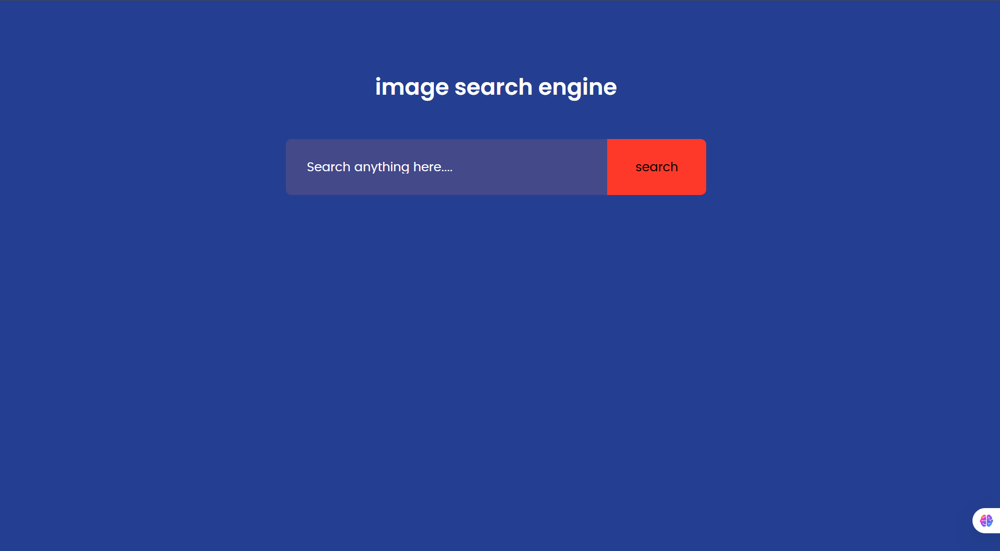
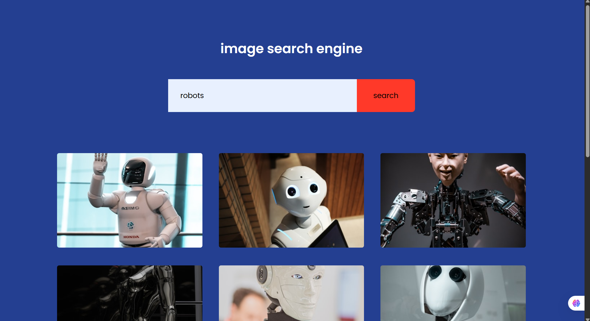
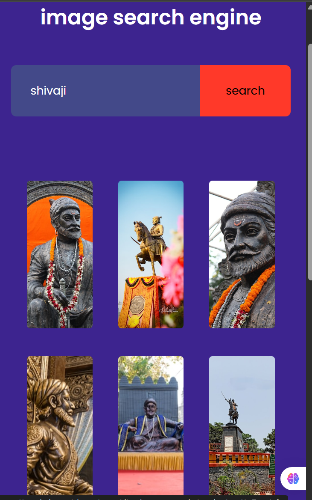

# 📸 Image Search Engine

A clean and interactive **web-based image search engine** that allows users to search for images using keywords and view results from the **Unsplash API**.  
It features a **minimal interface**, **dynamic image loading**, and a **"Show More"** functionality for pagination.

---

## ✨ Features
- 🔍 **Keyword Search** – Search for images by typing keywords into the search bar.
- 🖼 **Dynamic Image Display** – Fetches and displays images dynamically in a responsive grid.
- ➕ **Load More** – Click **"Show More"** to load additional images for the current search query.
- 🔗 **External Links** – Clicking on an image opens its source page on Unsplash in a new tab.
- 📱 **Responsive Design** – Works seamlessly on desktop and mobile devices.

---

## 🚀 Live Demo
[Click here to view the live demo](https://cveerababu15.github.io/Text_2_Image/)  


---

## 📸 Screenshots
> Replace these placeholders with your actual screenshots.

1. **Search Page**  
   

2. **Search Results**  
   

3. **Mobile View**  
   

---

## 🛠 Technologies Used
- **HTML5** – Structure of the application.
- **CSS3** – Styling, layout, and responsive design.
- **JavaScript (ES6+)** – Fetching data from the Unsplash API and dynamically updating the DOM.
- **Unsplash API** – Fetching high-quality photos based on search queries.
- **Google Fonts (Poppins)** – Clean and modern typography.

---

## ⚙ Installation & Setup
1. **Clone the repository**
   ```bash
   git clone https://github.com/YourUsername/Image-Search-Engine.git
